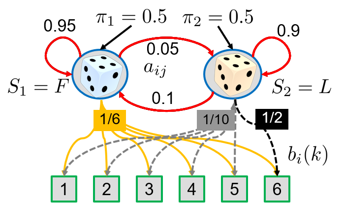

# Exercise week 6

This is your 6th mandatory exercise which must be completed until next week, i.e. 09.10.2023, 10:00. By that time please fill out the checklist on the [learnit page](https://learnit.itu.dk/course/view.php?id=3022225) to indicate which tasks you volunteer to present. 
You are very welcome to present incomplete solutions and describe what challenges you faced.
Please note that if not stated otherwise the programming exercises should be implemented by you, not by using a library. The intention is that you learn the transition from equations to code. Later in the course you are welcome to use programming frameworks.

## Task 1: Understanding Basic Recurrent Neural Networks (RNNs)

In this exercise, we aim to understand how RNNs are implemented and used in a current Deep Learning framework (in this case: pytorch), via *w06_rnn_pytorch.ipynb* (or in [Colab](https://colab.research.google.com/drive/19xK0mBSL8uVQMBq2993zIRGfzML1PaW5)).

The example is set up to learn a *language model* and generate text from it (so predict the next character, and the next, and so on). So the notebook includes many steps, so take your time and read carefully. Also, focus on the questions below and don't follow up on all the details, otherwise, this might be way too much to take in.

- Retrace the data loading and preprocessing and clarify conceptually:
   - How and why is the vocabulary dictionary built up?
   - What is the role of 'num_steps'?
  
- Retrace the model (first the implementation from scratch, then the RNN sub-module of the framework) and familiarise yourself with the data structure of the network tensor: **('num_steps', 'batch_size', 'vocab_size')**
   - Why is it a good idea to fix these parameters in the model building?
   - What is the effect of a small versus a large 'vocab_size'?
   
- Retrace the training steps and focus on the following questions:
   - How and why are <b>hidden states</b> initialised during training batches (and how is this different to non-Recurrent NN training)? 
   - Specifically: what would be the effect of initialising vs not initialising hidden states at the beginning of each first time-step of a sequence?
  
- Initialise the hidden states ('init_rnn_states') instead with other values (e.g. uniformly random values between 0 and 1) of with zeros. 
   - What is the effect?
   - How does the training behave when we use no gradient clipping?
   - What is the effect on the training when using other values for num_steps: e.g. 15, 60, and 120? *Note*: If training steps take too long on your system or in colab, then split this task within a group of several people and/or consider the HPC.
   

## Task 2: Understanding Gating in RNNs

Now we switch to tensorflow(-keras) and explore gating in RNNs, via *w06_rnn_text_generation_tensorflow.ipynb* (or in [Colab](https://colab.research.google.com/drive/1o6umoAPnwCL6PBk6dNj52u9xWKuPpWrX)).

The example is another text generation example with many in-detail explanations, thus it shows the major steps in solving NLP tasks with RNNs but is also very long. So carefully go through all steps and learn how technical details are realised differently from torch.
 
Retrace the implementation of the model and:

- Modify the example to run with the SimpleRNN instead of the GRU and note down your results as a baseline. How did the network perform (quality)?

- Now run the model using GRU: what are the major effects in training (speed and convergence) and results (quality)?

- Modify the example to run with LSTM cells instead: 
   - What is the effect? 
   - Is the performance different compared to using GRUs?
  
- Compare the parameters of the needed number for decent performance between GRU, LSTM and the baseline (the baseline/SimpleRNN might not converge)?

## Optional expert task 3:

Go through the text classification (Seq to Vec) and image captioning (Vec to Seq) examples, via *w06_rnn_text_classification_tensorflow* (or in [Colab](https://colab.research.google.com/drive/1yEBdIlV5Lr7dOVCga49WcGXriipvp29r)), and *w06_rnn_img_captioning_tensorflow* (or in [Colab](https://colab.research.google.com/drive/1nJgaMQYs8s4YLv0yrdgwtSXFOJl9wzkj)), and familiarise yourself for each about:

- How is the data preprocessed and represented?
- How (technically) is the vector information fed into and read from the RNN?

More material on text processing:
https://github.com/tensorflow/text/tree/master/docs

## Task 4: Determining Hidden Markov Model (HMM)
The HMM below describes the transitions between two hidden states (blue circles), i.e. a fair (F) and a loaded (L) die, and the resulting emitted observations. 
Depending on the current hidden state (top, blue) one observation (bottom, green), i.e. value between 1 and 6, is emitted. The observed output sequence is obtained by predefined probabilities as given by the values on the edges with matching color. 
This exercise assumes that we observe the outcome of throwing one die three times. 

A HMM $\lambda$ is defined by the following parameters: a transition matrix $\mathbf{A}$, an emission matrix $\mathbf{B}$, initial probabilities $\mathbf{\pi}$, hence the short notation defining the model is $\lambda=(\mathbf{\pi},\mathbf{A},\mathbf{B})$. 
In the following the observations are denoted as $\mathbf{O}$, and hidden states as $S=\\{S_1,S_2\\}$.

a. Write down the transition matrix $\mathbf{A}$ and the emission matrix $\mathbf{B}$.</li>

b. For the observation sequence $\mathbf{O}=(1,6,6)$, compute the probability of the hidden sequences (b1) $\mathbf{Q}=(F,L,L)$, and (b2) $\mathbf{Q}=(F,F,F)$, i.e. $P(\mathbf{O},\mathbf{Q}|\mathbf{\lambda})$. 
	Which is higher?</li>

c. How can the probability of an observation sequence given a model $P(\mathbf{O}|\mathbf{\lambda})$ be computed? Give the equation in detail, i.e. how the hidden states $\mathbf{Q}$ look like. </li>
 <!--/ol>
<ol type ="a" start="4"-->
d. Implement a function to compute $P(\mathbf{O},\mathbf{Q}|\mathbf{\lambda})$.</li>

e.Implement the Forward-Algorithm. Compute the equation for $P(\mathbf{O}|\mathbf{\lambda})$ which you derived in (c) using Python, i.e. define a function, which:
  
- receives an observation sequence $\mathbf{O}$ as input, and
- provides the probability of on the observation sequence $P(\mathbf{O}|\mathbf{\lambda})$ as output.

*Hint*: Consider how to get all needed combinations of the hidden state sequences. Then start with a fixed observation length of your choice, e.g. 3, then expand to arbitrary lengths. Please also share incomplete solutions, and what you found difficult.

</li>
</ol>
