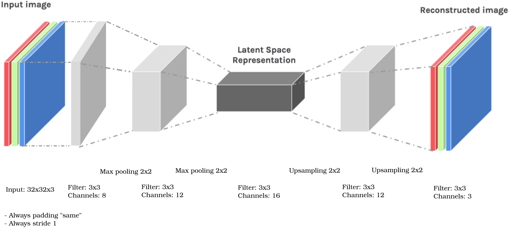

# Exercise week 8

This is your 8th mandatory exercise which must be completed until next week, i.e. 01.11.2023, 10:00. By that time please fill out the checklist on the [learnit page](https://learnit.itu.dk/course/view.php?id=3022225) to indicate which tasks you volunteer to present. 
You are very welcome to present incomplete solutions and describe what challenges you faced.
Please note that if not stated otherwise the programming exercises should be implemented by you, not by using a library. The intention is that you learn the transition from equations to code. Later in the course you are welcome to use programming frameworks.

## Task 1: Factorized Approximation

Implement the Mean Field Approach, based on Univariate Gaussian Example in Bishop, see Sec. 10.1.3.. The goal is to use the following factorised variational approximation for the posterior
$$q(\mu,\tau)  = q_\mu(\mu) q_\tau(\tau).$$
It can be shown that
$$q_\mu(\mu)   = \mathcal{N}(\mu| \mu_N,\lambda_N^{-1}) , ~   q_\tau(\tau) = \text{Gam}(\tau| a_N,b_N).$$

*Hint:* As you can see, all you need is the Gaussian distribution and the Gamma distribution. 
All is based on the equations in Sec. 10.1.3.

a. Create $N=20$ 1D random samples for a Gaussian distribution $\mathcal{N}(x|\mu,\tau^{-1} )$, with mean $\mu=0$ and precision $\tau=1$. (Set a random seed to make it reproducible.) </li>

b.Implement helper functions to evaluate $q_\tau$ and $q_\mu$.</li>

c. Implement the following algorithm
    <ol> 
      <li>initialize: $\mu_0=0$, $\lambda_0=1.2$ (previous version: $\lambda_0=0$, but this raises a problem because $\lambda_N^{-1}$ is in the prior), $a_0=1$, $b_0=1$, $\text{iter}_\text{max}=50$ </li>
      <li>Repeat the following:</li>
      <li>Update $q_\mu$: $\mu_N$ by (10.26), $\lambda_N$ by (10.27)</li>
      <li>Update $q_\tau$: $a_N$ by (10.29), $b_N$ by (10.30)</li>
      <li>Update $q(\mu,\tau) = q_\mu(\mu) q_\tau(\tau)$</li>
      <li>Stop if: $\text{iter}>\text{iter}_\text{max}$</li>
     </ol>
d. How does the result change if you change the number of maximum interactions? And how if 50 or 100 samples are used? </li>

e. Compare the true and estimated distributions by Kullback-Leibler Divergence.  
    Note: You do not need to implement this one yourself, as we do this for the discrete case in task 2. </li>  

f. You can plot your findings by plotting the true and approximated posterior in the parameter plane, i.e. $x$-axis $\mu$, $y$-axis $\tau$. </li>

g.What are sensible additional stopping criteria? Choose one and implement it. Monitor it during the iteration.</li>
</ol>
  
Notes and future to do:
(10.30) in [PR] has en expectation value with respect to $\mu$ which can be computed given the prior. 
Number of samples and counter for iterations has the same letter.

## Task 2: Kullback-Leibler Divergence
The Kullback-Leibler (KL) Divergence between two discrete random variables is defined analogue to the continuous version presented in the lecture
$$KL(q||p) = \sum_{x} q(x) \ln\left[\frac{q(x)}{p(x)} \right].$$
Your task is to compute the KL Divergence between two Bernoulli distributions, where each is given as
$$f(x|p) =  \begin{cases} p^x (1-p)^{1-x} &, \text{ if }x=0,1\\\ ~0 &, \text{ else,}  \end{cases}$$
with parameters specified below. 

a. Compute $KL(f(x|p_1)||f(x|p_2))$, and $KL(f(x|p_2)||f(x|p_1))$ for $p_1=0.4$, $p_2=0.8$ without toolboxes. You can do this by hand on paper or via coding. Keep in mind to only sum over the set of possible realisations $x\in\{0,1 \}$.</li> 

b. Compute $KL(f(x|p_1)||f(x|p_2))$, and $KL(f(x|p_2)||f(x|p_1))$ for $p_1=0.4$ by varying $p_2$. Plot your results, with $p_2$ on the $x$-axis and $KL(\cdot ||\cdot )$ on the $y$-axis. (Do not use a toolbox or package for this, i.e. implement the discrete KL Divergence by yourself.)</li>
</ol>

Note: edge cases have to be considered, e.g. p(x)=0

## Task 3: Understand and Implement Autoencoders

In this task, we want you to implement different autoencoders for the MNIST Fashion dataset, and then use it to approximate the original images, and compare your results to the PCA. (You can use a framework the PCA part, too.)
We suggest using [this notbook](https://colab.research.google.com/github/probml/pyprobml/blob/master/notebooks/book1/20/ae_mnist_tf.ipynb) as a starting point. 
Accompanying the course books [PML], are some other [python notebooks on github](https://github.com/probml/pyprobml/tree/master/notebooks/book1/20).

Your task is the following:
<ol type ="a">
  <li> Use a Deep Learning framework, e.g. feedforward NN, CNN, of your choice to construct a convolutional autoencoder that 
  <ol> 
      <li>takes an image from the MNIST fashion dataset as input</li>
      <li>produces a representation in latent space, and</li> 
      <li>attempts to reconstruct the original image as precisely as possible.</li></ol>
    As a starting point remember your experiences from exercise 4.1. What are good hyperparameter settings for NN/CNN layers?</li>
  <li>Use different bottleneck characteristics (sizes and filter properties, (non)-linear activation function). How do the reconstructions compare?</li>  
  <li>How do the AE results compare to the PCA results in terms of visual results and reconstruction error?</li>
 </ol>

One example architecture may look as follows *(9 layers, input size 32 × 32 × 3, CNN layer  filter size 3×3 and 8 channel, followed by max pooling layer which downsamples with a 2 × 2 filter, followed by another layer of filter size 3 × 3 and 12 channels)*:

*Hints:* 
- Padding is ”same” throughout the entirety of the network. In other words, padding is 1 for convolutional layers, and 0 for pooling or upsampling layers,
- Stride is always 1,
- Use the images as both the input and the desired output of your network,
- Normalise the data.
- Optional suggestion: Experiment with different activation functions and error functions, and data set divisions.

